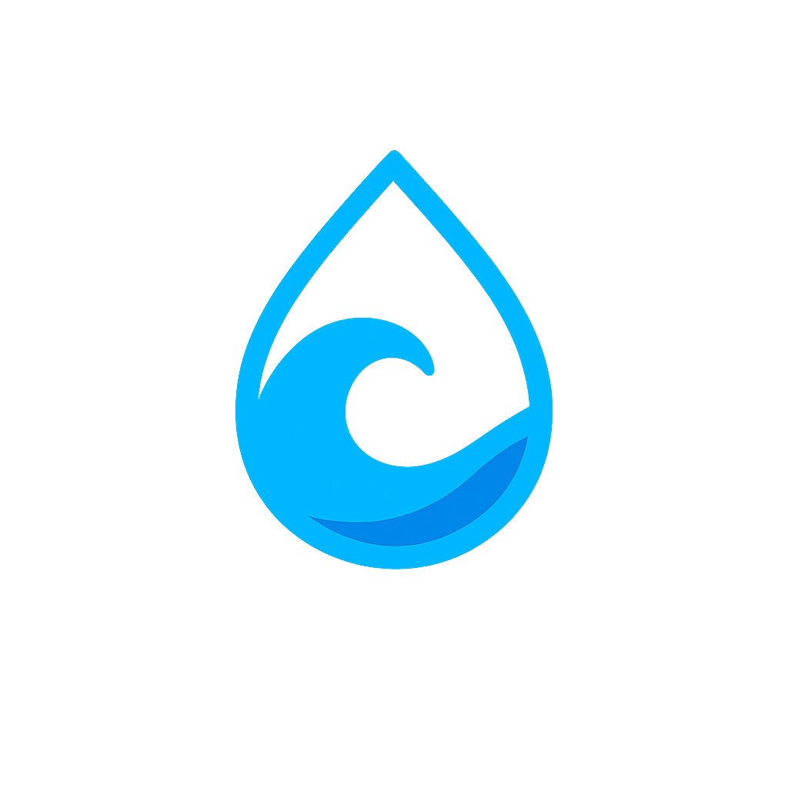

# 🌊 AquaDAO - Decentralized Autonomous Organization

<div align="center">
  
  
  [](LICENSE)
  [](https://soliditylang.org/)
  [](https://getfoundry.sh/)
  [](https://nextjs.org/)
  [](https://www.typescriptlang.org/)
  [](https://wagmi.sh/)
  [](https://tailwindcss.com/)

**A modern, fully-decentralized autonomous organization platform that empowers communities to make collective decisions through transparent, on-chain governance.**

[🚀 Live Demo](https://aqua-dao.vercel.app) • [� Screenshots](./SCREENSHOTS.md) • [�📖 Documentation](#documentation) • [🛠️ Installation](#quick-start) • [💬 Community](#community)

</div>

---

## 🌟 Overview

AquaDAO is a complete DAO ecosystem that combines powerful Solidity smart contracts with an intuitive Next.js frontend. Built for the modern Web3 era, it provides everything needed to establish and operate a decentralized autonomous organization.

### ✨ What Makes AquaDAO Special?

- 🏛️ **Complete Governance System** - From proposal creation to execution
- 💎 **Fair Tokenomics** - Simple and transparent token distribution
- 🏦 **Secure Treasury** - Community-controlled fund management
- 🎨 **Beautiful UI/UX** - Modern, responsive interface with dark mode
- 🔐 **Security First** - Comprehensive test coverage and audit-ready code
- 🌐 **Production Ready** - Deployed and tested on Ethereum testnets

---

## 🎯 Key Features

<div align="center">
  <table>
    <tr>
      <td align="center" width="33%">
        <br/>
        <b>🗳️ Democratic Governance</b><br/>
        Token-weighted voting with transparent proposal system
      </td>
      <td align="center" width="33%">
        <br/>
        <b>💎 AQUA Token</b><br/>
        ERC20 governance token with simple 1:1 ETH minting
      </td>
      <td align="center" width="33%">
        <br/>
        <b>🏦 Treasury Management</b><br/>
        Secure, community-controlled fund management
      </td>
    </tr>
  </table>
</div>

### 🏛️ **Governance Features**

- ✅ **Proposal Creation** - Submit proposals for community voting
- ✅ **Democratic Voting** - One token, one vote system
- ✅ **Execution Engine** - Automatic execution of passed proposals
- ✅ **Time-bound Voting** - Configurable voting periods
- ✅ **Proposal States** - Active, Executed, Failed status tracking

### 💎 **Token Economics**

- ✅ **Fair Distribution** - Open minting at 1 wei per token
- ✅ **Governance Rights** - Voting power proportional to holdings
- ✅ **Treasury Funding** - All minting fees go to community treasury
- ✅ **ERC20 Standard** - Full compatibility with DeFi ecosystem

### 🏦 **Treasury System**

- ✅ **Secure Storage** - Multi-signature controlled funds
- ✅ **Transparent Operations** - All movements recorded on-chain
- ✅ **Community Oversight** - Public visibility of all activities
- ✅ **Controlled Access** - Only authorized operations allowed

---

## 🏗️ Architecture

AquaDAO consists of two main components:

<div align="center">
  <table>
    <tr>
      <td align="center" width="50%">
        <br/>
        <b>🔗 Smart Contracts</b><br/>
        <i>Solidity + Foundry</i><br/>
        <a href="./aqua-dao-contact/README.md">📚 Backend Documentation →</a>
      </td>
      <td align="center" width="50%">
        <br/>
        <b>🎨 Frontend dApp</b><br/>
        <i>Next.js + TypeScript + Wagmi</i><br/>
        <a href="./aqua-dao-ui/README.md">📚 Frontend Documentation →</a>
      </td>
    </tr>
  </table>
</div>

### � Smart Contracts Overview

- **AquaDAO.sol** - Main governance contract
- **AquaGovToken.sol** - ERC20 governance token
- **AquaDAOTreasury.sol** - Treasury management

### 🎨 Frontend Overview

- **Modern UI** - Built with Next.js 15 and Tailwind CSS
- **Web3 Integration** - Wagmi v2 for seamless blockchain interaction
- **Responsive Design** - Mobile-first approach with dark mode support
- **Type Safety** - Full TypeScript implementation

### 🌆 Screenshots

[Screenshots Gallery](./SCREENSHOTS.md)

---

## 🚀 Quick Start

### 📋 Prerequisites

- **Node.js** v18+ and npm/bun
- **Foundry** for smart contract development
- **MetaMask** or compatible Web3 wallet
- **Git** for cloning the repository

### ⚡ Installation

```bash
# Clone the repository
git clone https://github.com/kavinda-100/AquaDAO.git
cd AquaDAO

# Install backend dependencies
cd aqua-dao-contact
make install

# Install frontend dependencies
cd ../aqua-dao-ui
bun install # or npm install

# Set up environment variables
cp .env.example .env
# Edit .env with your configuration
```

### 🔧 Development Setup

```bash
# Terminal 1: Start Anvil local blockchain
cd aqua-dao-contact
make persist-state-dump

# Terminal 2: Deploy smart contracts
cd aqua-dao-contact
make deploy-local

# Terminal 3: Start frontend development server
cd aqua-dao-ui
bun dev # or npm run dev
```

Visit `http://localhost:3000` to see your local AquaDAO instance! 🎉

---

## 📖 Documentation

| Component               | Description                                       | Link                                           |
| ----------------------- | ------------------------------------------------- | ---------------------------------------------- |
| � **Screenshots**       | Visual showcase of the AquaDAO interface          | [Interface Gallery](./SCREENSHOTS.md)          |
| �🔗 **Smart Contracts** | Solidity contracts, tests, and deployment scripts | [Backend README](./aqua-dao-contact/README.md) |
| 🎨 **Frontend dApp**    | Next.js application with Web3 integration         | [Frontend README](./aqua-dao-ui/README.md)     |
| 🏛️ **Governance Guide** | How to create proposals and vote                  | Coming Soon                                    |
| 🏦 **Treasury Guide**   | Managing community funds                          | Coming Soon                                    |
| 🔐 **Security Guide**   | Best practices and audit results                  | Coming Soon                                    |

---

## 🌐 Deployment

### 🧪 Testnets

- **Anvil Testnet** - Primary testing environment
- **Sepolia Testnet** - Secondary testing environment

### 🏭 Mainnet

- **Ethereum Mainnet** - Production deployment (coming soon)

### 📊 Contract Addresses

Check the [deployment summary](./aqua-dao-contact/deployment-summary.json) for current contract addresses.

---

## 🧪 Testing

```bash
# Run smart contract tests
cd aqua-dao-contact
forge test
```

---

## 📄 License

This project is licensed under the MIT License - see the [LICENSE](LICENSE) file for details.

---

## 🙏 Acknowledgments

- **OpenZeppelin** - Security-focused smart contract libraries
- **Foundry** - Fast and flexible Ethereum development toolkit
- **Next.js** - The React framework for production
- **Wagmi** - React hooks for Ethereum
- **Tailwind CSS** - Utility-first CSS framework
- **Lucide React** - Beautiful and consistent icon library

---

<div align="center">
  <b>Built with ❤️ by <a href="https://github.com/kavinda-100">Kavinda Rathnayake</a></b><br/>
  <i>Making decentralized governance accessible to everyone</i>
</div>
