# 📸 AquaDAO - Interface Screenshots

  
  
  **Visual showcase of the AquaDAO decentralized autonomous organization platform**
  
  [🏠 Back to Main](./README.md) • [🔗 Live Demo](https://aqua-dao.vercel.app) • [📖 Documentation](./README.md#documentation)

---

## 🌟 Platform Overview

Experience the modern, intuitive interface of AquaDAO - where governance meets exceptional user experience. Our platform combines powerful Web3 functionality with beautiful, responsive design.

---

## 🏠 Home Page

  
  <h3>Landing & Welcome Experience</h3>

The home page provides an engaging introduction to AquaDAO, featuring our mission, key benefits, and easy navigation to all platform features.

  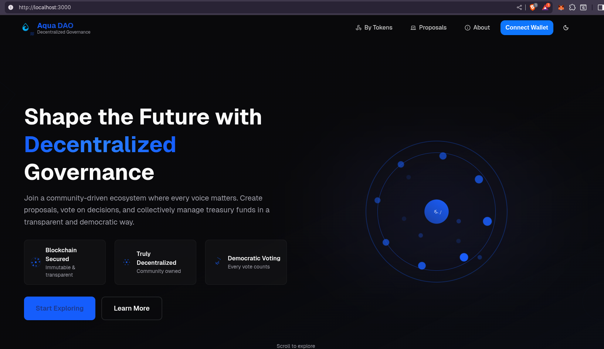
  
<i>🎯 Hero section with clear value proposition and call-to-action</i>

  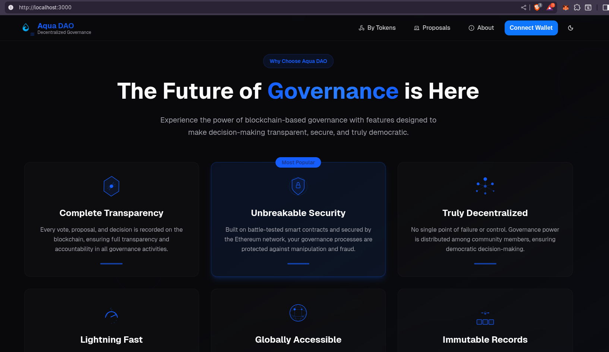
  
<i>✨ Features showcase with modern card layouts and animations</i>

---

## ℹ️ About Page

  
  <h3>Project Information & Mission</h3>

Learn about AquaDAO's vision, mission, and values. This page provides comprehensive information about our decentralized governance solution.

  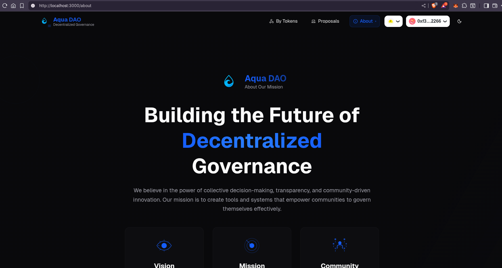
  
<i>🚀 Mission and vision statement with elegant typography</i>

  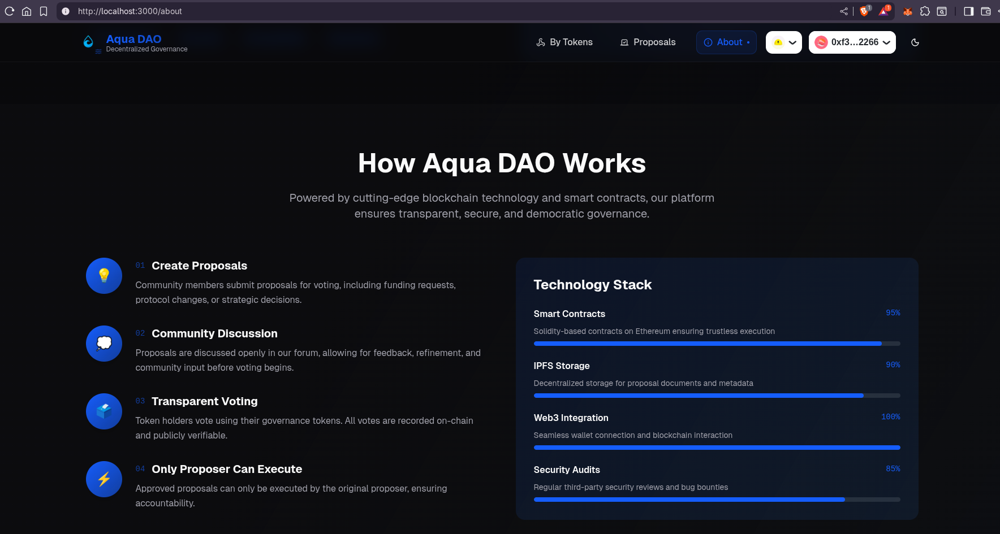
  
<i>⚡ Technology stack showcase with interactive elements</i>

---

## 💎 Buy Token Page

  
  <h3>AQUA Token Acquisition</h3>

Simple and secure token purchasing interface with real-time balance updates and transaction tracking. Get your governance tokens to participate in DAO decisions.

  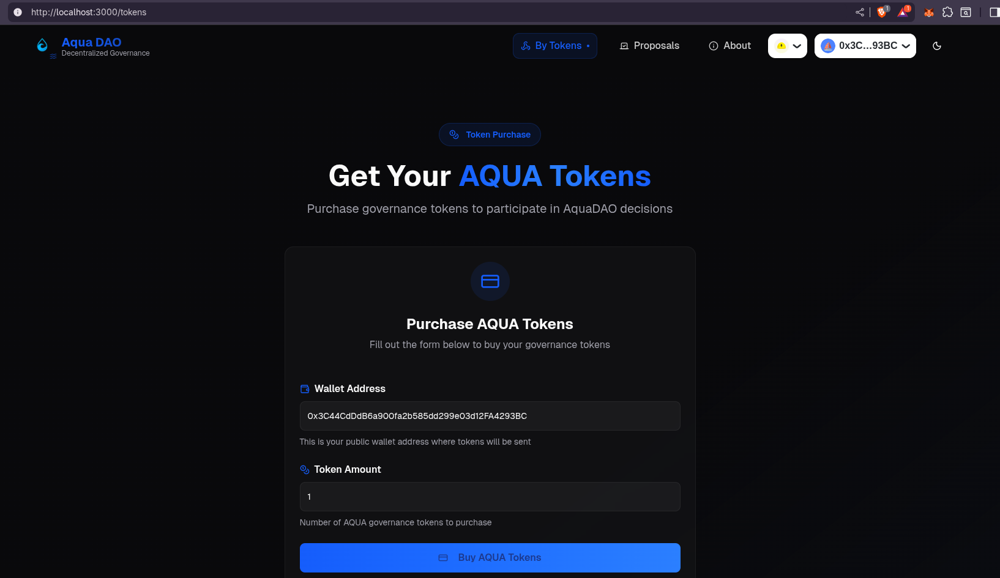
  
<i>💰 Clean token purchase interface with balance display</i>

  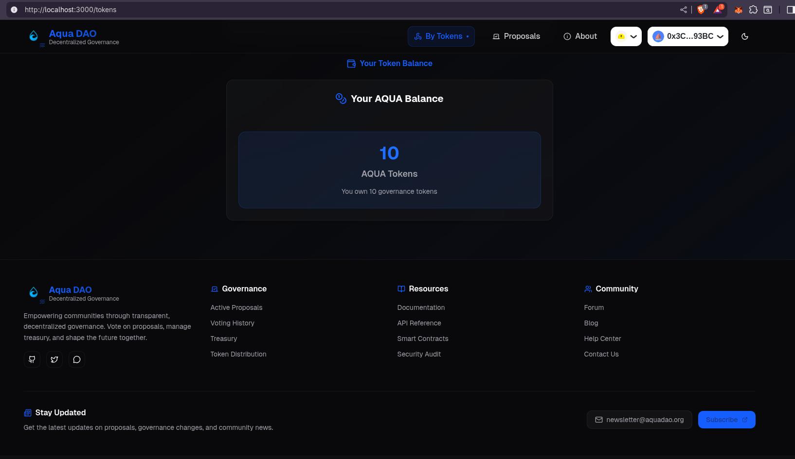
  
<i>✅ Transaction confirmation with gas estimation and security features</i>

---

## 🗳️ Governance Dashboard

  
  <h3>My Proposals Management</h3>

Personal dashboard for managing your submitted proposals, tracking their status, and monitoring voting progress.

  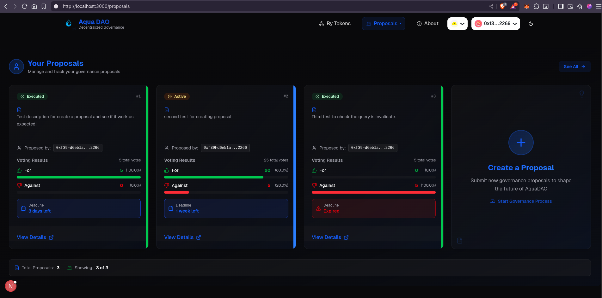
  
<i>📊 Personal proposal management with status indicators and analytics</i>

---

## 📋 Proposal Details

  
  <h3>Comprehensive Proposal View</h3>

Detailed proposal information with voting interface, time remaining, and real-time vote counts. Make informed decisions with all the information you need.

  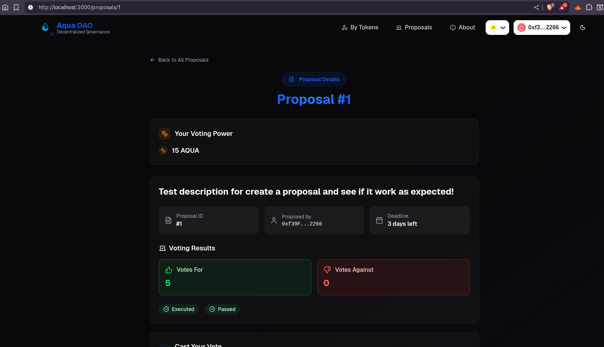
  
<i>📋 Proposal header with status, timing, and key metrics</i>

  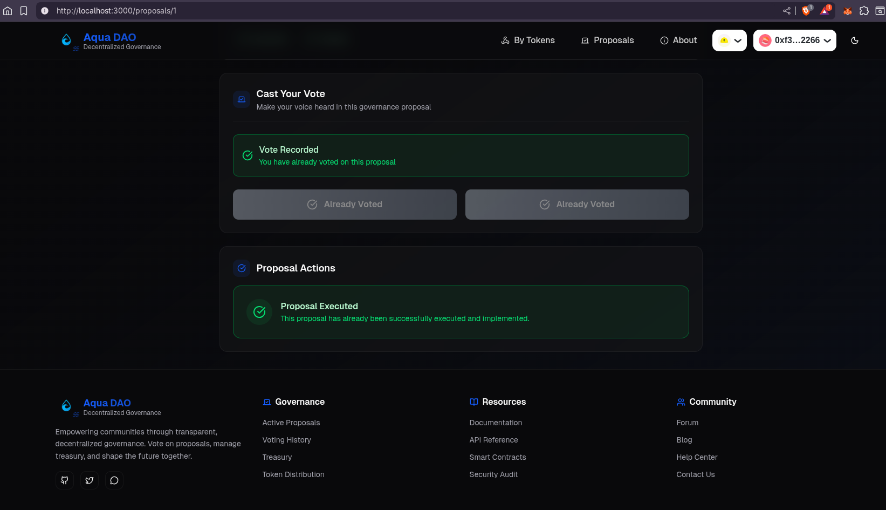
  
<i>🗳️ Interactive voting interface with vote counts and user voting power</i>

  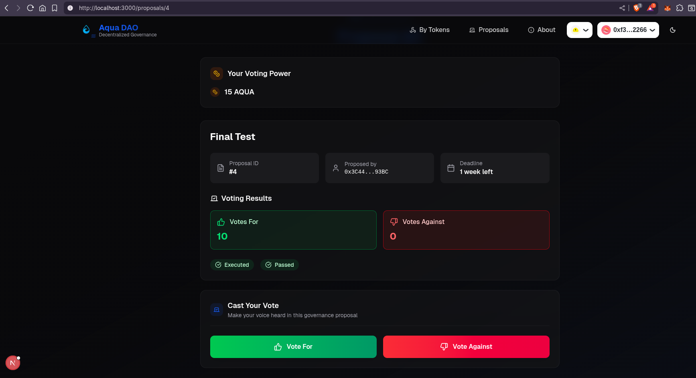
  
<i>⚡ Proposal execution interface for successful proposals</i>

---

## 🏛️ Proposal Hub

  
  <h3>Community Governance Center</h3>

Central hub for all DAO proposals with filtering, sorting, and comprehensive overview of community governance activity.

  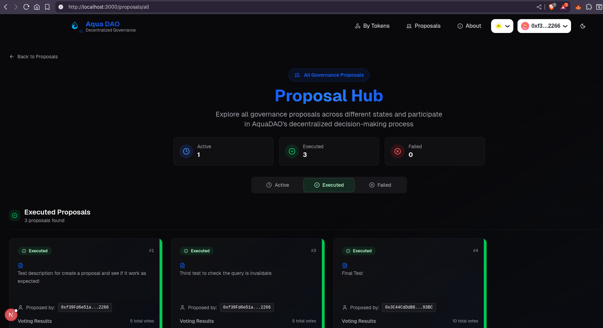
  
<i>🏛️ Comprehensive proposal hub with categorized tabs and search functionality</i>

  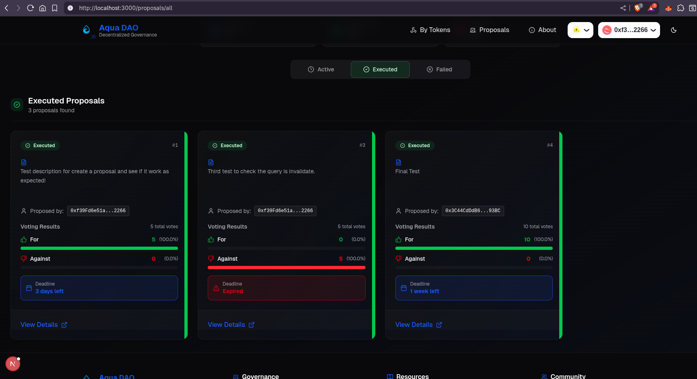
  
<i>📱 Responsive proposal cards with status indicators and quick actions</i>

---

## 🎨 Design Highlights

  <table>
    <tr>
      <td align="center" width="25%">
         
        <b>🎯 Modern UI</b> 
        Glass morphism effects
      </td>
      <td align="center" width="25%">
         
        <b>📱 Responsive</b> 
        Mobile-first design
      </td>
      <td align="center" width="25%">
         
        <b>♿ Accessible</b> 
        WCAG compliant
      </td>
      <td align="center" width="25%">
         
        <b>⚡ Fast</b> 
        Optimized performance
      </td>
    </tr>
  </table>

### 🌟 **Key Features Showcased**

- ✅ **Intuitive Navigation** - Clear, consistent navigation patterns
- ✅ **Real-time Updates** - Live data and transaction status
- ✅ **Professional Aesthetics** - Modern gradients and animations
- ✅ **User Feedback** - Comprehensive loading and error states
- ✅ **Security Indicators** - Clear transaction confirmations and warnings

---

  <b>🎨 Interface crafted with attention to detail by <a href="https://github.com/kavinda-100">Kavinda Rathnayake</a></b> 
  <i>Bringing Web3 governance to life through exceptional user experience</i>  
  
  [🏠 Back to Main](./README.md) • [🔧 Frontend Documentation](./aqua-dao-ui/README.md) • [⚙️ Backend Documentation](./aqua-dao-contact/README.md)

