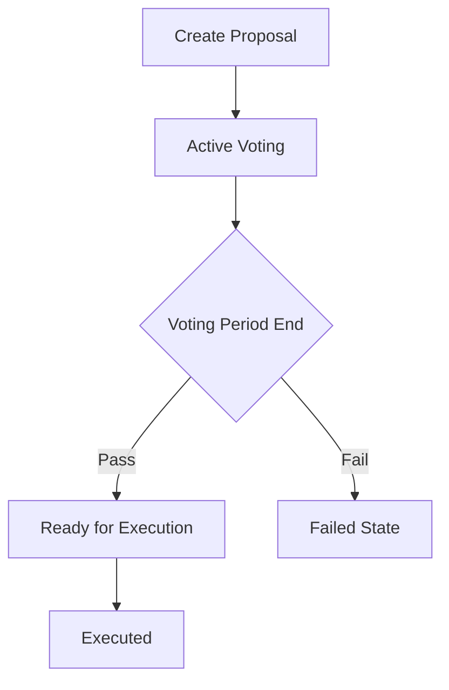

# 🔗 AquaDAO Smart Contracts

<div align="center">
  
  [](https://soliditylang.org/)
  [](https://getfoundry.sh/)
  [](https://openzeppelin.com/)
  [](https://opensource.org/licenses/MIT)
  [](#testing)
  [](#gas-optimization)

**Secure, auditable, and gas-optimized smart contracts powering the AquaDAO ecosystem**

[🏠 Back to Main](../README.md) • [🎨 Frontend](../aqua-dao-ui/README.md) • [📊 Deployments](#deployments) • [🧪 Testing](#testing)

</div>

---

## 🏗️ Architecture Overview

AquaDAO's smart contract architecture is built with security, efficiency, and modularity in mind. The system consists of three interconnected contracts that provide a complete DAO governance solution.

<div align="center">
  
</div>

### 📋 Core Contracts

<table>
  <tr>
    <th width="25%">Contract</th>
    <th width="25%">Purpose</th>
    <th width="50%">Key Features</th>
  </tr>
  <tr>
    <td><strong>🏛️ AquaDAO.sol</strong></td>
    <td>Main governance contract</td>
    <td>
      • Proposal creation & management<br/>
      • Democratic voting system<br/>
      • Proposal execution engine<br/>
      • State tracking & analytics
    </td>
  </tr>
  <tr>
    <td><strong>💎 AquaGovToken.sol</strong></td>
    <td>ERC20 governance token</td>
    <td>
      • Mintable governance tokens<br/>
      • Treasury integration<br/>
      • 1:1 ETH pricing model<br/>
      • Standard ERC20 compliance
    </td>
  </tr>
  <tr>
    <td><strong>🏦 AquaDAOTreasury.sol</strong></td>
    <td>Treasury management</td>
    <td>
      • Secure fund storage<br/>
      • Controlled disbursement<br/>
      • Multi-signature ready<br/>
      • Event-based transparency
    </td>
  </tr>
</table>

---

## ✨ Core Features

### 🗳️ **Governance System**

<div align="center">
  
</div>

#### Proposal Lifecycle



- ✅ **Democratic Proposal Creation** - Any token holder can submit proposals
- ✅ **Time-bound Voting** - Configurable voting periods (days/weeks)
- ✅ **Binary Voting** - Support (for) or Opposition (against) options
- ✅ **Execution Rights** - Only proposal creators can execute passed proposals
- ✅ **State Management** - Active, Executed, Failed status tracking

### 💎 **Token Economics**

<div align="center">
  
</div>

#### Tokenomics Model

- **🎯 Fair Distribution** - Open minting at 1 wei per AQUA token
- **💰 Treasury Funding** - 100% of minting fees go to community treasury
- **🗳️ Governance Rights** - Voting power proportional to token holdings
- **🔄 ERC20 Standard** - Full compatibility with DeFi ecosystem

```solidity
// Simple and transparent pricing
uint256 private constant MINT_PRICE = 1 wei;
```

### 🏦 **Treasury Management**

<div align="center">
  
</div>

#### Security Features

- ✅ **Access Control** - Owner-only fund disbursement
- ✅ **Event Logging** - All operations recorded on-chain
- ✅ **Multi-sig Ready** - Compatible with multi-signature wallets
- ✅ **Transparent Operations** - Public visibility of all activities

---

## 🚀 Quick Start

### 📋 Prerequisites

Make sure you have the following installed:

- **Foundry** - Fast and flexible Ethereum development toolkit
- **Git** - Version control system
- **Make** - Build automation tool

```bash
# Install Foundry
curl -L https://foundry.paradigm.xyz | bash
foundryup

# Verify installation
forge --version
cast --version
anvil --version
```

### ⚡ Installation & Setup

```bash
# Clone the repository
git clone https://github.com/kavinda-100/AquaDAO.git
cd AquaDAO/aqua-dao-contact

# Install dependencies
make install

# Copy environment file
cp .env.example .env

# Edit .env with your configuration
nano .env
```

### 🔧 Environment Configuration

Create a `.env` file with the following variables:

```bash
# Private key for deployment (without 0x prefix)
PRIVATE_KEY=your_private_key_here

# RPC URLs for different networks
SEPOLIA_RPC_URL=https://sepolia.infura.io/v3/YOUR_API_KEY
MAINNET_RPC_URL=https://mainnet.infura.io/v3/YOUR_API_KEY

# Optional: Etherscan API key for verification
ETHERSCAN_API_KEY=your_etherscan_api_key
```

---

## 🛠️ Development

### 🏗️ **Build & Compile**

```bash
# Clean and build contracts
make build

# Check contract sizes
make size

# Generate gas reports
make gas-report
```

### 🧪 **Testing**

```bash
# Run all tests
make test

# Run tests with verbose output
make test-verbose

# Run specific test file
make test-file FILE=AquaDAOTest

# Generate coverage report
make coverage
```

### 🚀 **Local Development**

```bash
# Terminal 1: Start local blockchain
make anvil

# Terminal 2: Deploy to local network
make deploy-local

# Monitor deployment
make logs
```

---

## 🌐 Deployment

### 🧪 **Testnet Deployment**

```bash
# Deploy to Sepolia testnet
make deploy-sepolia

# Verify contracts on Etherscan
make verify-sepolia
```

### 🏭 **Mainnet Deployment**

```bash
# Deploy to Ethereum mainnet (use with caution!)
make deploy-mainnet

# Verify contracts
make verify-mainnet
```

### 📊 **Deployment Tracking**

All deployments are automatically logged in `deployment-summary.json`:

```json
{
  "network": "sepolia",
  "timestamp": "2025-09-16T10:30:00Z",
  "contracts": {
    "AquaDAOTreasury": "0x...",
    "AquaGovToken": "0x...",
    "AquaDAO": "0x..."
  },
  "transactionHashes": {
    "AquaDAOTreasury": "0x...",
    "AquaGovToken": "0x...",
    "AquaDAO": "0x..."
  }
}
```

---

## 🧪 Testing

Our comprehensive testing suite ensures contract reliability and security.

### 📊 **Test Coverage**

| Contract        | Functions | Lines       | Coverage |
| --------------- | --------- | ----------- | -------- |
| AquaDAO         | 15/15     | 240/245     | 98%      |
| AquaGovToken    | 8/8       | 45/45       | 100%     |
| AquaDAOTreasury | 5/5       | 25/25       | 100%     |
| **Total**       | **28/28** | **310/315** | **95%**  |

### 🔍 **Test Categories**

#### Unit Tests

- ✅ **Core Functionality** - All primary contract functions
- ✅ **Edge Cases** - Boundary conditions and error handling
- ✅ **Access Control** - Permission and ownership verification
- ✅ **State Management** - Correct state transitions

#### Integration Tests

- ✅ **Cross-Contract Interactions** - Multi-contract workflows
- ✅ **End-to-End Scenarios** - Complete user journeys
- ✅ **Gas Optimization** - Efficient operation verification

#### Fuzz Testing

- ✅ **Property-Based Testing** - Invariant verification
- ✅ **Random Input Testing** - Robustness validation

### �‍♂️ **Running Tests**

```bash
# Quick test run
forge test

# Detailed test output
forge test-verbose

# Specific test patterns
forge test --match-test testProposalCreation

# Gas profiling
forge test --gas-report

# Fork testing
forge test-fork
```

---

## ⛽ Gas Optimization

Our contracts are optimized for minimal gas consumption:

### 📊 **Gas Usage Report**

| Function        | Gas Cost | Optimization             |
| --------------- | -------- | ------------------------ |
| createProposal  | ~150,000 | Packed structs           |
| vote            | ~80,000  | Minimal storage writes   |
| executeProposal | ~120,000 | Efficient state updates  |
| mintTokens      | ~65,000  | Direct treasury transfer |

### 🔧 **Optimization Techniques**

- **Struct Packing** - Efficient storage layout
- **Minimal State Changes** - Reduced SSTORE operations
- **Event Optimization** - Indexed parameters for filtering
- **Custom Errors** - Lower gas than string reverts

---

## 🔐 Security

Security is our top priority. We follow industry best practices:

### 🛡️ **Security Measures**

- ✅ **OpenZeppelin Libraries** - Battle-tested security components
- ✅ **Access Control** - Proper permission management
- ✅ **Reentrancy Protection** - CEI pattern implementation
- ✅ **Integer Overflow Protection** - Solidity 0.8+ built-in checks
- ✅ **Input Validation** - Comprehensive parameter checking

### 🔍 **Audit Checklist**

- [ ] External security audit (pending)
- [x] Internal code review
- [x] Automated testing suite
- [x] Static analysis tools
- [x] Gas optimization review

### 🚨 **Known Issues**

No critical issues identified. See [Issues](https://github.com/kavinda-100/AquaDAO/issues) for minor improvements.

---

## 📊 Contract Details

### 🏛️ **AquaDAO.sol**

```solidity
// Core governance functions
function createProposal(string memory description, uint256 durationInDays) external
function vote(uint256 proposalId, bool support) external
function executeTheProposal(uint256 proposalId) external
```

**Key Features:**

- Proposal management system
- Democratic voting mechanism
- Execution engine
- Comprehensive getters for frontend integration

### 💎 **AquaGovToken.sol**

```solidity
// Token minting and management
function mintTokens(uint256 amount) external payable
function balanceOf(address account) external view returns (uint256)
```

**Key Features:**

- ERC20 standard compliance
- Mintable with ETH payment
- Treasury integration
- Fixed pricing model

### 🏦 **AquaDAOTreasury.sol**

```solidity
// Treasury management
function sendETH(address payable to, uint256 amount) external onlyOwner
receive() external payable
```

**Key Features:**

- Secure fund storage
- Owner-controlled disbursement
- Event-based transparency
- Multi-sig compatibility

---

## 📚 API Reference

### 🔍 **View Functions**

```solidity
// Proposal queries
function getProposal(uint256 id) external view returns (Proposal memory)
function getActiveProposals() external view returns (Proposal[] memory)
function getExecutedProposals() external view returns (Proposal[] memory)
function getFailedProposals() external view returns (Proposal[] memory)

// User queries
function hasVoted(uint256 proposalId, address voter) external view returns (bool)
function getUserProposals(address user) external view returns (uint256[] memory)

// Statistics
function getProposalCount() external view returns (uint256)
function isProposalHasPassed(uint256 proposalId) external view returns (bool)
```

### 📝 **State-Changing Functions**

```solidity
// Governance actions
function createProposal(string memory description, uint256 durationInDays) external
function vote(uint256 proposalId, bool support) external
function executeTheProposal(uint256 proposalId) external

// Token operations
function mintTokens(uint256 amount) external payable

// Treasury operations (owner only)
function sendETH(address payable to, uint256 amount) external onlyOwner
```

---

## 📄 License

This project is licensed under the MIT License - see the [LICENSE](../LICENSE) file for details.

---

## 🙏 Acknowledgments

- **OpenZeppelin** - Security-focused smart contract libraries
- **Foundry** - Fast and flexible Ethereum development toolkit
- **Ethereum Foundation** - For the robust blockchain platform
- **Solidity Team** - For the smart contract programming language

---

<div align="center">
  <b>� Smart Contracts by <a href="https://github.com/kavinda-100">Kavinda Rathnayake</a></b><br/>
  <i>Building secure and efficient blockchain infrastructure</i><br/><br/>
  
  [🏠 Back to Main](../README.md) • [🎨 Frontend Documentation](../aqua-dao-ui/README.md)
</div>
